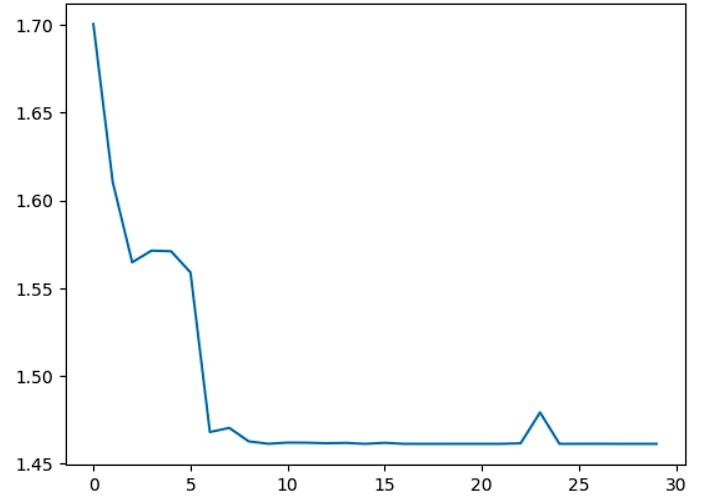

# MNIST手写数字CNN识别
赵健淳 202017190221 20级卓越班
## 1.背景介绍
MNIST是一个包含了7万张28×28像素的灰度手写数字图片的数据集，其中6万张用于训练，1万张用于测试。它是一个经典的计算机视觉问题，目标是根据图片的像素值来预测图片中的数字是0到9中的哪一个。<br>
CNN是卷积神经网络的简称，它是一种特殊的人工神经网络，能够有效地处理图像等高维数据。它由多个卷积层、池化层和全连接层组成，能够自动地提取图像的特征，并且具有平移不变性、局部连接性和参数共享性等优点。<br>
使用CNN来识别MNIST手写数字是一个常见的机器学习任务，有很多教程和示例可以参考。一般来说，需要先对数据进行预处理，例如归一化等，然后构建一个CNN模型，包括卷积层、激活层、池化层、全连接层等，然后定义损失函数和优化器，最后使用训练集来训练模型，并使用测试集来评估模型的准确率和泛化能力。

## 2.神经网络构建思路
### 2.1 数据预处理
根据MNIST开源数据集的数据特性，应当将原始数据归一化后进行训练和预测。
进行数据归一化有以下几个好处：
- 数据归一化可以加快梯度下降求最优解的速度，也就是加快模型的收敛性。这是因为归一化后的数据更接近标准正态分布，使得目标函数更平滑，梯度的方向更接近最小值的方向。
- 数据归一化可以提高模型的精度，特别是在涉及到距离计算的算法中。这是因为归一化后的数据可以消除不同特征之间的量级差异，使得每个特征对结果的影响更均衡。
- 数据归一化可以简化计算，减少内存空间和计算资源的消耗。这是因为归一化后的数据都在一个较小的范围内，可以避免数值溢出或者下溢等问题。

### 2.2 网络结构
根据MNIST手写数字数据集特性，设计了一个用于分类的卷积神经网络模型，它有以下几个特点：

- 它有两个卷积层，分别有6个和16个输出通道，用于提取图像中的特征。每个卷积层后面都跟着一个最大池化层，用于降低特征图的维度和增加平移不变性。
- 它有三个全连接层，分别有120，84和10个输出节点，用于将提取到的特征映射到分类标签上。最后一个全连接层使用softmax激活函数，用于输出每个类别的概率。
- 它使用ReLU作为激活函数，用于增加模型的非线性和收敛速度。
- 它使用交叉熵作为损失函数，用于衡量模型输出和真实标签之间的差异。
- 它使用随机梯度下降作为优化器，用于更新模型的参数。

选择这个网络结构的理由有以下几点：

- 这个网络结构是基于LeNet-5的改进版本，LeNet-5是一个经典的卷积神经网络架构，它在MNIST数据集上取得了很好的效果。
- 这个网络结构是比较简单和易于实现的，它没有使用太多的复杂操作或技巧，适合作为入门级的示例。
- 这个网络结构是比较高效和节省资源的，它只有大约6万个参数，占用的内存空间和计算资源都不多，可以在一般的设备上快速地训练和运行。

## 3.相关代码
### 3.1 Python文件
这里给出文件树以及相关文件的大致介绍，同时代码文件开源在Github网站上->[传送门](https://github.com/TantalumKevin/CNN-MNIST)。
```python
│  .gitignore #git忽略文件
│  log.txt    #程序输出log记录
│  loss.jpg   #训练loss可视化图像
│  main.py    #主文件,包含训练相关内容
│  network.py #定义CNN网络类
│  predata.py #定义数据预处理相关函数
│             #并将归一化的数据文件保存成npz格式以方便再次运行
│  README.md  #说明文件
│
└─MNIST       #数据集文件夹
   │  norm.npz #归一化后的合并数据集,由于Github文件大小限制，此处并未上传Github
   │
   └─raw #原始数据集
           t10k-images-idx3-ubyte
           t10k-images-idx3-ubyte.gz
           t10k-labels-idx1-ubyte
           t10k-labels-idx1-ubyte.gz
           train-images-idx3-ubyte
           train-images-idx3-ubyte.gz
           train-labels-idx1-ubyte
           train-labels-idx1-ubyte.gz
```
### 3.2 在线Notebook
这里给出相同超参数配置的网络的在线Notebook([Kaggle](https://www.kaggle.com/kevintantalum/mnist))<br>
在该网站可选择使用GPU设备加速训练。

## 4.结论
根据目前CNN模型结构和参数设置，MNIST手写数字识别的准确率可以达到98.9%以上，甚至接近100%，训练loss曲线如下图所示。<br>

这说明该CNN网络是一种非常有效的图像识别网络，可以应用于各种复杂的视觉任务中。<br>
当然，这个网络结构也有一些局限性和缺点，例如：

- 这个网络结构可能不够深入和强大，它可能无法提取到更高层次和更抽象的特征，从而影响模型的准确率和泛化能力。
- 这个网络结构可能存在过拟合或欠拟合的风险，它可能无法适应不同的数据分布或噪声，从而影响模型的稳定性和鲁棒性。
- 这个网络结构可能不适用于其他类型或规模的图像数据集，它可能需要根据不同的问题进行调整或优化。

因此，需要不断地改进和优化CNN的设计和实现，以提高其性能和可解释性。